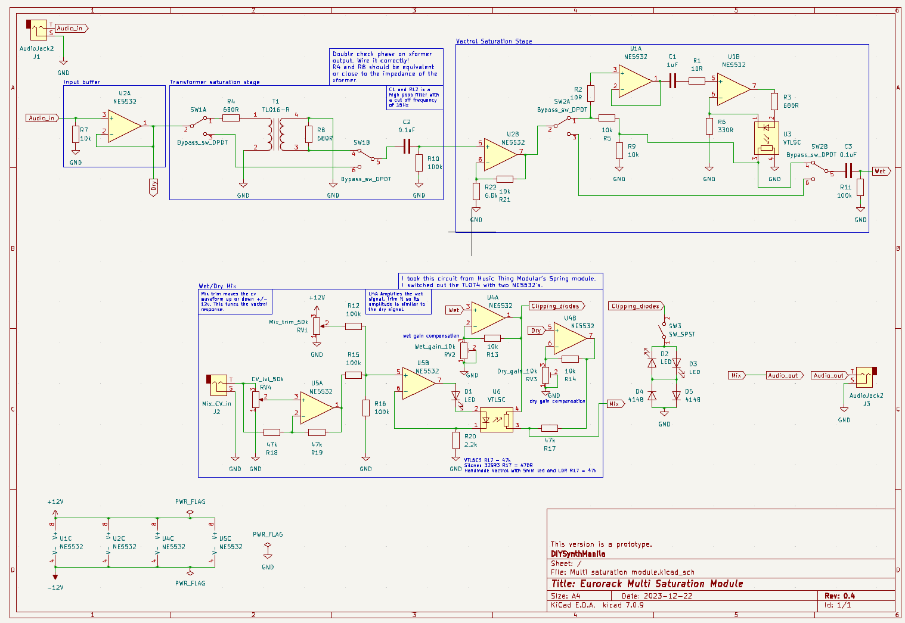

# Single Saturation Module - Transformer

## Some background.

I’m designing a distortion/saturation modular synth module using different methods of distorting audio signals.

## Inspiration

### DIYRe’s Colour Modules

I got some ideas from DIYRe's Colour modules. DIYRe is a company that produces DIY kits for professional audio recording equipment. Some of their product offerings include recording studio rackmount effects.

[The Colour Format](https://www.diyrecordingequipment.com/pages/the-colour-format)

| Colour Module | What does it do? | What ideas did you get? | Link to page | Schematic |
| --- | --- | --- | --- | --- |
| CTX Transformer Colour | A transformer saturation module with a discrete opamp and a Cinemag audio transformer which has a 1:1 turns ratio. | Non-inverting amp to drive the transformer past what it can handle. Resistor before the transformer that isolates the opamp from the transformer. | https://www.diyrecordingequipment.com/products/ctx-cinemag-transformer-colour-mkii | https://cdn.shopify.com/s/files/1/0698/2265/files/CTX_mkII_Schematic.pdf?375 |
| Colourphone | A telephone sound emulator. It uses a bandpass filter and a 1:1 turn ratio audio transformer. | I have a similar transformer which is a 600:600 ohm transformer. Resistor before the transformer that isolates it from the opamp. | https://www.diyrecordingequipment.com/products/colourphone-telephone-distortion-colour | https://cdn.shopify.com/s/files/1/0698/2265/files/XQP_Colourphone_Schematic_1.3.pdf?8973696934571457842 |

### Other sources

- Eliot Sound Products - is a website full of audio articles that I’ve learned from
    - [Designing With OpAmps](https://sound-au.com/)
    - [Audio Transformers](https://sound-au.com/)
- Automatic gain amplifier
    - [Vactrol auto gain op amp](https://www.youtube.com/watch?v=Cg2cLocjgGQ)
- Vactrol wet/dry mix from music thing modular’s spring reverb module
    - [https://www.musicthing.co.uk/Spring-Reverb/](https://www.musicthing.co.uk/Spring-Reverb/)

# Circuit Design

### Stages

1. Input gain stage (buffer only, see design note below)
    
    
    
    We must take into account the headroom of the op amp. The NE5532 can only output 2 volts less than the supply voltage. So for example, your supply voltage would be +/- 12V, your max output would be 10V based on the image below.
    
    
    
    A buffer would suffice as the input stage. We wouldn’t be able to amplify the 10Vpp input to 12Vpp unless we use a +/- 15V supply. 
    
    
    
    Taken from sound-au.com
    
2. Transformer Saturation
    
    
    
3. Voltage controlled Vactrol Wet/Dry mix
    
    I used my handmade Vactrol. I made it using a 5mm diffused red LED and a 5mm LDR enclosed with black heat shrink tubing. I crimped the ends so no light would leak in. 47k works for R13 with my Vactrol.
    
    
    
4. Output gain stage (not yet tested)
    
    This is not necessary for this module, this is for my multi saturation module design. You could just use a buffer as an output stage.
    
    
    

## Some circuit housekeeping todo

- Reverse polarity protection
- I/O protection
- Unused opamps
- Power filter caps
- Audio decoupling if necessary
